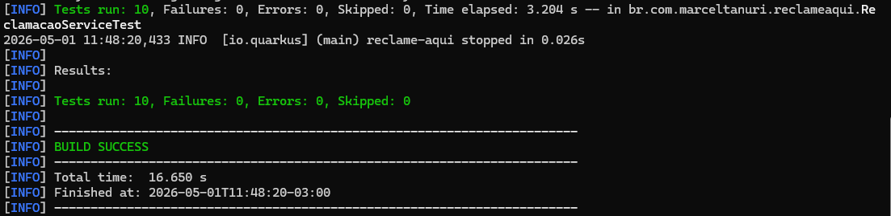
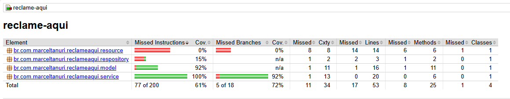

# Reclame Aqui API

Esta é uma API de exemplo para gerenciar reclamações, construída com Quarkus.

## Banco de Dados

Para executar o banco de dados MySQL em um contêiner Docker, use o seguinte comando:

```shell
docker run --name mysql-container \
  -p 3306:3306 \
  -e MYSQL_ROOT_PASSWORD=root \
  -e MYSQL_DATABASE=reclameaqui \
  -d mysql:latest
```

## Executando a Aplicação

Para limpar o projeto e iniciar a aplicação em modo de desenvolvimento, execute o seguinte comando na raiz do projeto (`aula5_part2/reclame-aqui`):

```shell
./mvnw clean quarkus:dev
```

A aplicação estará disponível em `http://localhost:8080`.

## Endpoints da API

A API expõe os seguintes endpoints para gerenciar reclamações:

### 1. Listar Reclamações

-   **Método:** `GET`
-   **Path:** `/reclamacoes`
-   **Descrição:** Retorna uma lista de reclamações. Suporta filtragem por texto e paginação.
-   **Parâmetros de Query:**
    -   `filtro` (opcional, `String`): Filtra reclamações cujo título ou descrição contenham o texto fornecido (case-insensitive).
    -   `pagina` (opcional, `int`, default: `0`): O número da página para a paginação.
    -   `tamanhoPagina` (opcional, `int`, default: `10`): O número de itens por página.
-   **Exemplo:** `GET /reclamacoes?filtro=bacon&pagina=0&tamanhoPagina=5`
-   **Resposta de Sucesso:** `200 OK`
    ```json
    [
        {
            "id": 1,
            "titulo": "Bacon ipsum dolor amet...",
            "descricao": "Bacon ipsum dolor amet leberkas sirloin tongue corned beef capicola.",
            "autor": "Marcel"
        }
    ]
    ```

### 2. Buscar Reclamação por ID

-   **Método:** `GET`
-   **Path:** `/reclamacoes/{id}`
-   **Descrição:** Retorna uma reclamação específica pelo seu ID.
-   **Exemplo:** `GET /reclamacoes/1`
-   **Resposta de Sucesso:** `200 OK`
    ```json
    {
        "id": 1,
        "titulo": "Bacon ipsum dolor amet...",
        "descricao": "Bacon ipsum dolor amet leberkas sirloin tongue corned beef capicola.",
        "autor": "Marcel"
    }
    ```
-   **Resposta de Erro:** `404 Not Found` se a reclamação não for encontrada.

### 3. Criar uma Nova Reclamação

-   **Método:** `POST`
-   **Path:** `/reclamacoes`
-   **Descrição:** Cria uma nova reclamação. Se o campo `titulo` não for fornecido ou estiver em branco, um título será gerado automaticamente através da API externa [baconipsum.com](https://baconipsum.com/).
-   **Corpo da Requisição (JSON):**
    ```json
    {
        "descricao": "Meu produto veio com defeito e o atendimento foi péssimo.",
        "autor": "Cliente Insatisfeito"
    }
    ```
-   **Resposta de Sucesso:** `201 Created`
    ```json
    {
        "id": 2,
        "titulo": "Bacon ipsum dolor amet leberkas sirloin tongue corned beef capicola.",
        "descricao": "Meu produto veio com defeito e o atendimento foi péssimo.",
        "autor": "Cliente Insatisfeito"
    }
    ```

### 4. Atualizar uma Reclamação

-   **Método:** `PUT`
-   **Path:** `/reclamacoes/{id}`
-   **Descrição:** Atualiza uma reclamação existente.
-   **Corpo da Requisição (JSON):**
    ```json
    {
        "titulo": "Título Atualizado",
        "descricao": "Descrição atualizada.",
        "autor": "Autor Atualizado"
    }
    ```
-   **Resposta de Sucesso:** `200 OK`
-   **Resposta de Erro:** `404 Not Found` se a reclamação não for encontrada.

### 5. Deletar uma Reclamação

-   **Método:** `DELETE`
-   **Path:** `/reclamacoes/{id}`
-   **Descrição:** Deleta uma reclamação pelo seu ID.
-   **Resposta de Sucesso:** `204 No Content`

## Testes Unitários

Esta aplicação utiliza uma suite de testes unitários (projeto final) para garantir a confiabilidade das regras de negócio na 
camada de serviço (`ReclamacaoService`). Os testes foram desenvolvidos utilizando **JUnit 5**, **Mockito** e as 
facilidades de teste do **Quarkus**.

### Estratégia de Teste
A cobertura de testes foca no isolamento de dependências, garantindo que a lógica de negócio seja validada 
sem necessidade de conexão com banco de dados real ou APIs externas. 
Para isso, utilizamos o padrão **AAA (Arrange, Act, Assert)** e **Mocks** para simular o comportamento do 
repositório e do cliente REST.

### Tecnologias utilizadas para os testes

*   **JUnit5**
*   **Mockito**
*   **Assertions**
*   **Quarkus Test**

### Cenários Implementados

Os testes cobrem cenários positivos (caminhos felizes), alternativos e negativos (caminhos não felizes):

*   **Listagem (`listar`):** Validação de busca com e sem filtros, garantindo a eficiência das queries e o tratamento correto no caso de strings vazias.
*   **Criação (`criar`):** Verificação da regra de preenchimento automático de títulos. O teste garante que a API externa só seja chamada quando for necessário e que o sistema seja resiliente a falhas na integração.
*   **Atualização (`atualizar`):** Tratamento de Ids inexistentes e validação da integridade da atualização dos campos título, descrição e localidade.
*   **Exclusão (`deletar`):** Verificação da ordem de exclusão correta para o repositório e tratamento de exceções.

### Execução dos Testes
Para executar os testes unitários, utilize o comando:
```shell
mvn test
```

### Evidência da execução dos Testes

#### Execução no prompt de comandos

Aqui está a execução do suite de testes `mvn test`



#### Relatório de cobertura dos testes

Aqui está o relatório de cobertura dos testes disponibilizados pelo JaCoCo




